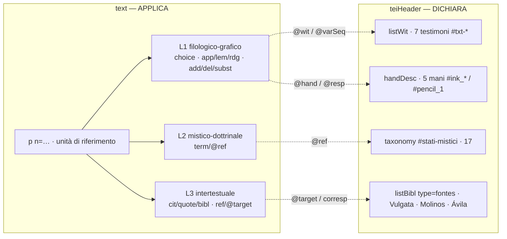

# Modello TEI dell'edizione — i tre layer

## *Il Castello dell'anima*, Libro III · ms. Palermo, BCP, 2 Qq E 29

  

Questa cartella contiene i **modelli TEI generici** dell'edizione — la *macro-struttura* del `teiHeader` e del `<text>` — indipendenti dai singoli micro-commit. I file dei micro-commit (`Micro-commits/MC-1/…`) **valorizzano** questi modelli con la trascrizione e i metadati reali.

Questo documento è la **fonte canonica** della descrizione del modello a tre layer: i sotto-README di `header/` e `text/` la presuppongono e la applicano al proprio ambito.

---

## Il modello a tre layer su due livelli di trascrizione

L'edizione è *leggera*: un solo asse interpretativo (gli stati mistici), niente annotazione multiassiale. Ogni fenomeno del testo ricade in uno di **tre layer**, tutti ancorati a identificatori **dichiarati una sola volta nel `teiHeader`** e **richiamati nel `<text>`** via puntatori.

| Layer | Scopo | Elementi nel `<text>` | Ancora nel `teiHeader` |
|---|---|---|---|
| **L1 · filologico-grafico** | struttura, trascrizione a **due livelli**, apparato genetico d'autrice | `div`/`head`/`argument`/`p`/`pb`/`fw`; `choice` (`orig`/`reg`, `abbr`/`expan`, `sic`/`corr`); `app`/`lem`/`rdg` (`@wit`,`@varSeq`); `add`/`del`/`subst` (`@place`,`@hand`,`@resp`,`@type`); `unclear`/`gap`/`supplied` | `listWit` (7 testimoni `#txt-*`) · `handDesc` (5 mani `#ink_*`/`#pencil_1`) |
| **L2 · mistico-dottrinale** | lessico degli stati dell'unione | `term` con `@ref` | `taxonomy xml:id="stati-mistici"` (17 categorie) |
| **L3 · intertestuale** | citazioni e rimandi alle fonti | `cit`/`quote`/`foreign`/`bibl` · `ref` con `@target` | `listBibl type="fontes"` (Vulgata, Molinos, Ávila) |

I **due livelli di trascrizione** (diplomatico ⇄ interpretativo) vivono dentro il **Layer 1** tramite `<choice>`: la lezione conservativa e la sua regolarizzazione coesistono, senza che l'una sostituisca l'altra. L'**unità di riferimento** è il paragrafo `
`, non il `<seg>`.

### Fuori dal modello (progetto gemello)
L'annotazione interpretativa multiassiale — `seg`/`@ana` a più assi, indice d'impatto, *feature structures*, `standOff`, `figure`/`interp` — **non** fa parte di questa edizione: è sviluppata nel repository separato [`castello-anima-TEI-IA`](https://github.com/luciano-longo77/castello-anima-TEI-IA).

---

## Come i due file lavorano insieme

Il `teiHeader` **dichiara** (vocabolari, testimoni, mani, fonti); il `<text>` **applica** rinviando a quelle dichiarazioni con `#id`. Nessuna lista è ridichiarata nel corpo.

---

## Contenuto della cartella

| | Modello (macro-struttura) | Guida | Diagramma | Viewer |
|---|---|---|---|---|
| **Header** | [`header/teiHeader-model.xml`](header/teiHeader-model.xml) | [`header/readme-model-Header.md`](header/readme-model-Header.md) | [`header/model-Header-diagramma.md`](header/model-Header-diagramma.md) | [`header/output/teiHeadermodel_viewer.html`](header/output/teiHeadermodel_viewer.html) |
| **Text** | [`text/text-model.xml`](text/text-model.xml) | [`text/readme-model-text.md`](text/readme-model-text.md) | [`text/model-text-diagramma.md`](text/model-text-diagramma.md) | [`text/output/textmodel_viewer.html`](text/output/textmodel_viewer.html) |

> I modelli XML sono **scheletri**: elementi a contenuto vuoto che fissano la struttura e le dichiarazioni. Validano contro lo schema ODD di progetto (`castello-anima-odd.rng`).

---

## Licenza
Creative Commons Attribution 4.0 International (**CC BY 4.0**).

---

## 👤 Curatore
**Luciano Longo**
- Contatti: <luciano.longo@dedalus.com>
- ORCID: <https://orcid.org/0009-0005-7557-7546>
- GitHub: <https://github.com/luciano-longo77>
- Website: <https://luciano-longo77.github.io>
