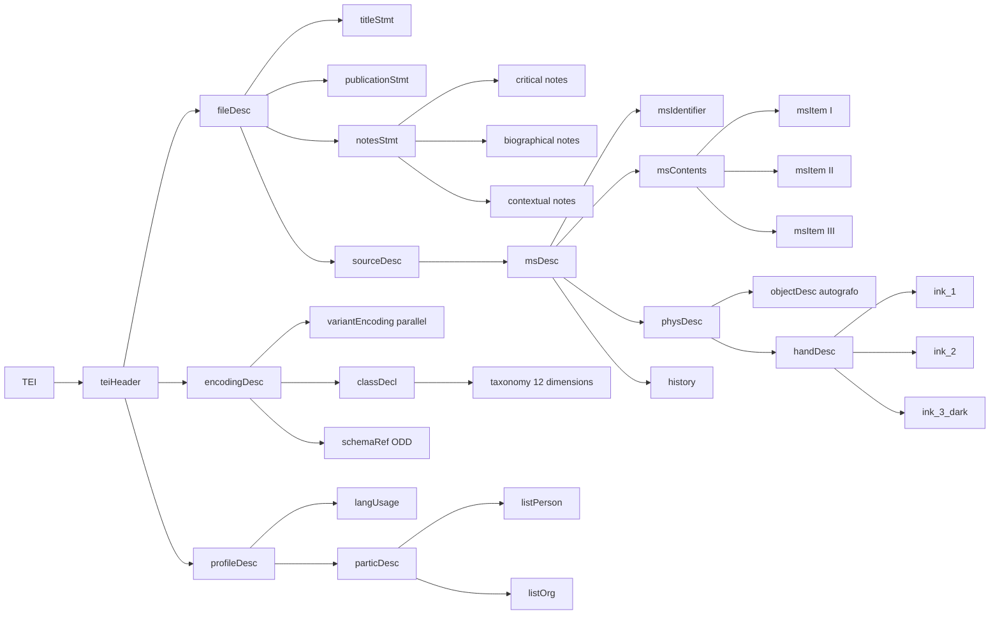

```mermaid
graph LR

  %% ===== ROOT =====
  TEI --> H[teiHeader]

  %% ===== HEADER BLOCS =====
  H --> FD[fileDesc]
  H --> ED[encodingDesc]
  H --> PD[profileDesc]

  %% =====================================================
  %% FILEDESC
  %% =====================================================
  FD --> TS[titleStmt]
  FD --> PS[publicationStmt]
  FD --> NS[notesStmt]
  FD --> SD[sourceDesc]

  NS --> CRIT[critical notes]
  NS --> BIO[biographical notes]
  NS --> CTX[contextual notes]

  %% =====================================================
  %% SOURCEDESC / MSDESC
  %% =====================================================
  SD --> MSD[msDesc]

  MSD --> ID[msIdentifier]
  MSD --> MC[msContents]
  MSD --> PHY[physDesc]
  MSD --> HIS[history]

  MC --> I1[msItem I]
  MC --> I2[msItem II]
  MC --> I3[msItem III]

  PHY --> OBJ[objectDesc autografo]
  PHY --> HD[handDesc]

  HD --> H1[ink_1]
  HD --> H2[ink_2]
  HD --> H3[ink_3_dark]

  %% =====================================================
  %% ENCODINGDESC
  %% =====================================================
  ED --> VAR[variantEncoding parallel]
  ED --> CLS[classDecl]
  ED --> SCH[schemaRef ODD]

  CLS --> TAX[taxonomy 12 dimensions]

  %% =====================================================
  %% PROFILEDESC
  %% =====================================================
  PD --> LANG[langUsage]
  PD --> PART[particDesc]

  PART --> PER[listPerson]
  PART --> ORG[listOrg]
```
