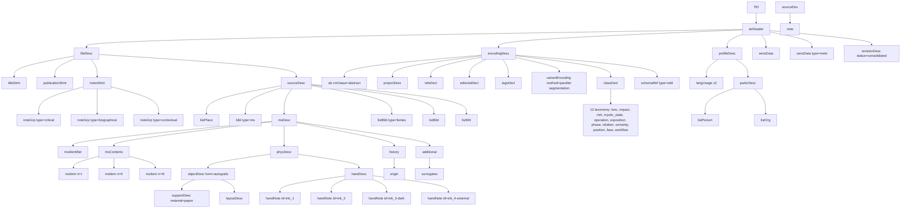

```mermaid
graph TD
  TEI --> teiHeader
  teiHeader --> fileDesc
  teiHeader --> encodingDesc
  teiHeader --> profileDesc
  teiHeader --> xenoData1["xenoData"]
  teiHeader --> xenoData2["xenoData type=mets"]
  teiHeader --> revisionDesc["revisionDesc status=consolidated"]

  fileDesc --> titleStmt
  fileDesc --> publicationStmt
  fileDesc --> notesStmt
  fileDesc --> sourceDesc

  notesStmt --> ng1["noteGrp type=critical"]
  notesStmt --> ng2["noteGrp type=biographical"]
  notesStmt --> ng3["noteGrp type=contextual"]

  sourceDesc --> listPlace
  sourceDesc --> biblMs["bibl type=ms"]
  sourceDesc --> msDesc
  sourceDesc --> lb1["listBibl type=fontes"]
  sourceDesc --> lb2["listBibl"]
  sourceDesc --> listWit

  msDesc --> msIdentifier
  msDesc --> msContents
  msDesc --> physDesc
  msDesc --> history
  msDesc --> additional

  msContents --> mi1["msItem n=I"]
  msContents --> mi2["msItem n=II"]
  msContents --> mi3["msItem n=III"]

  physDesc --> objDesc["objectDesc form=autografo"]
  physDesc --> handDesc

  objDesc --> supDesc["supportDesc material=paper"]
  objDesc --> layoutDesc

  handDesc --> hn1["handNote id=ink_1"]
  handDesc --> hn2["handNote id=ink_2"]
  handDesc --> hn3["handNote id=ink_3-dark"]
  handDesc --> hn4["handNote id=ink_4-external"]

  history --> origin
  additional --> surrogates

  encodingDesc --> ab["ab xml:base=abstract"]
  encodingDesc --> projectDesc
  encodingDesc --> refsDecl
  encodingDesc --> editorialDecl
  encodingDesc --> tagsDecl
  encodingDesc --> varEnc["variantEncoding method=parallel-segmentation"]
  encodingDesc --> classDecl
  encodingDesc --> schemaRef["schemaRef type=odd"]

  classDecl --> tax["12 taxonomy: func, impact, risk, mystic_state, operation, exposition, phase, relation, certainty, position, fase, workflow"]

  profileDesc --> langUsage["langUsage x2"]
  profileDesc --> particDesc
  particDesc --> listPerson
  particDesc --> listOrg

  sourceDoc --> note
```
