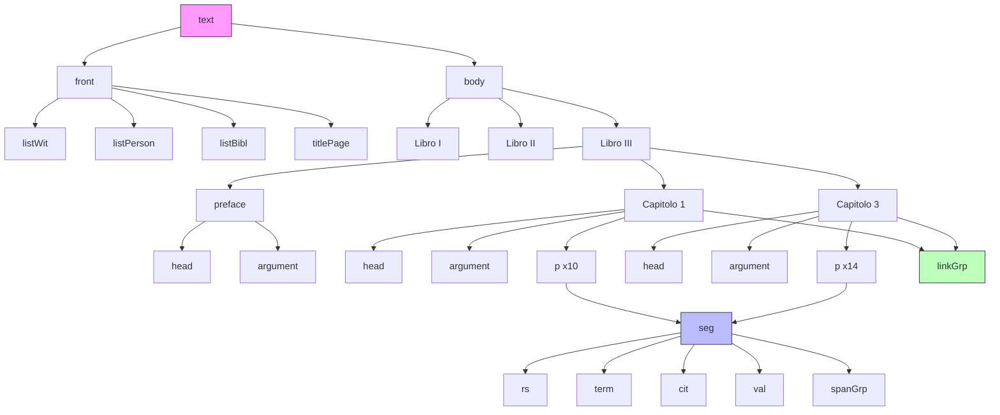

```mermaid
graph TD
  text[text] --> front[front]
  text --> body[body]
  
  front --> listWit[listWit]
  front --> listPerson[listPerson]
  front --> listBibl[listBibl]
  front --> titlePage[titlePage]
  
  body --> libro1[Libro I]
  body --> libro2[Libro II]
  body --> libro3[Libro III]
  
  libro3 --> preface[preface]
  libro3 --> cap1[Capitolo 1]
  libro3 --> cap3[Capitolo 3]
  
  preface --> headPref[head]
  preface --> argumentPref[argument]
  
  cap1 --> head1[head]
  cap1 --> argument1[argument]
  cap1 --> paragraphs1[p x10]
  
  cap3 --> head3[head]
  cap3 --> argument3[argument]
  cap3 --> paragraphs3[p x14]
  
  paragraphs1 --> seg[seg]
  paragraphs3 --> seg
  
  seg --> rs[rs]
  seg --> term[term]
  seg --> cit[cit]
  seg --> val[val]
  seg --> spanGrp[spanGrp]
  
  cap1 --> linkGrp[linkGrp]
  cap3 --> linkGrp
  
  style text fill:#f9f,stroke:#333
  style seg fill:#bbf,stroke:#333
  style linkGrp fill:#bfb,stroke:#333
```
