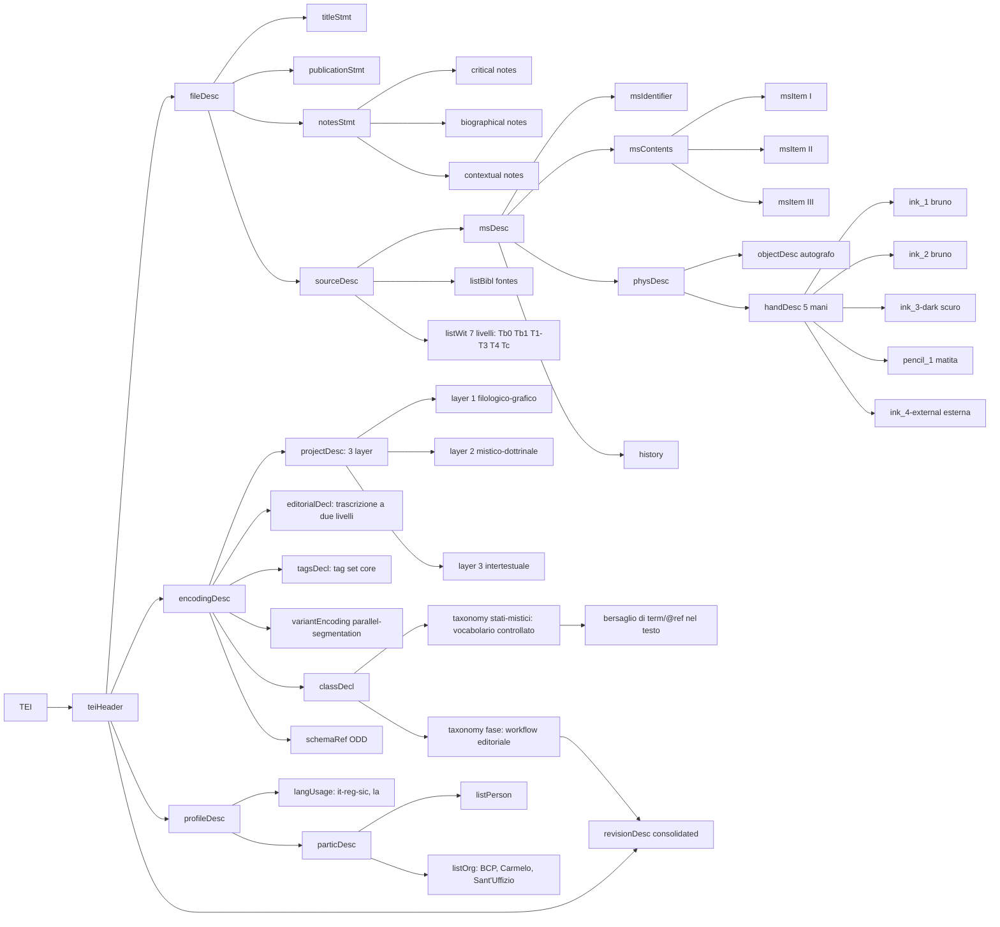

```mermaid
graph LR

  %% ===== ROOT =====
  TEI --> H[teiHeader]

  %% ===== HEADER BLOCS =====
  H --> FD[fileDesc]
  H --> ED[encodingDesc]
  H --> PD[profileDesc]
  H --> RD[revisionDesc consolidated]

  %% =====================================================
  %% FILEDESC
  %% =====================================================
  FD --> TS[titleStmt]
  FD --> PS[publicationStmt]
  FD --> NS[notesStmt]
  FD --> SD[sourceDesc]

  NS --> CRIT[critical notes]
  NS --> BIO[biographical notes]
  NS --> CTX[contextual notes]

  %% =====================================================
  %% SOURCEDESC / MSDESC
  %% =====================================================
  SD --> MSD[msDesc]
  SD --> LBF[listBibl fontes]
  SD --> LW[listWit 7 livelli: Tb0 Tb1 T1-T3 T4 Tc]

  MSD --> ID[msIdentifier]
  MSD --> MC[msContents]
  MSD --> PHY[physDesc]
  MSD --> HIS[history]

  MC --> I1[msItem I]
  MC --> I2[msItem II]
  MC --> I3[msItem III]

  PHY --> OBJ[objectDesc autografo]
  PHY --> HD[handDesc 5 mani]

  HD --> H1[ink_1 bruno]
  HD --> H2[ink_2 bruno]
  HD --> H3[ink_3-dark scuro]
  HD --> H4[pencil_1 matita]
  HD --> H5[ink_4-external esterna]

  %% =====================================================
  %% ENCODINGDESC  (modello a tre layer)
  %% =====================================================
  ED --> PJ[projectDesc: 3 layer]
  ED --> EDCL[editorialDecl: trascrizione a due livelli]
  ED --> TG[tagsDecl: tag set core]
  ED --> VAR[variantEncoding parallel-segmentation]
  ED --> CLS[classDecl]
  ED --> SCH[schemaRef ODD]

  PJ --> L1[layer 1 filologico-grafico]
  PJ --> L2[layer 2 mistico-dottrinale]
  PJ --> L3[layer 3 intertestuale]

  CLS --> TAX[taxonomy stati-mistici: vocabolario controllato]
  CLS --> FASE[taxonomy fase: workflow editoriale]

  TAX --> TREF[bersaglio di term/@ref nel testo]
  FASE --> RD

  %% =====================================================
  %% PROFILEDESC
  %% =====================================================
  PD --> LANG[langUsage: it-reg-sic, la]
  PD --> PART[particDesc]

  PART --> PER[listPerson]
  PART --> ORG[listOrg: BCP, Carmelo, Sant'Uffizio]
```
