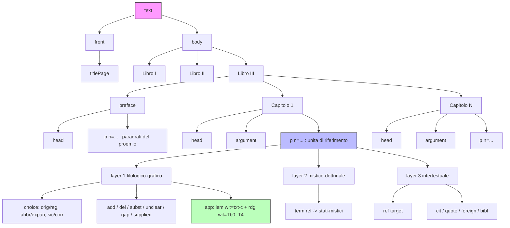

```mermaid
graph TD
  text[text] --> front[front]
  text --> body[body]

  front --> titlePage[titlePage]
  %% listWit / listPerson / listBibl NON stanno nel front: sono dichiarati nel teiHeader

  body --> libro1[Libro I]
  body --> libro2[Libro II]
  body --> libro3[Libro III]

  libro3 --> preface[preface]
  libro3 --> cap1[Capitolo 1]
  libro3 --> capN[Capitolo N]

  preface --> headPref[head]
  preface --> pPref[p n=... : paragrafi del proemio]

  cap1 --> head1[head]
  cap1 --> argument1[argument]
  cap1 --> paragraphs1[p n=... : unita di riferimento]

  capN --> headN[head]
  capN --> argumentN[argument]
  capN --> paragraphsN[p n=...]

  %% Dentro <p>: i tre layer, nessun seg/@ana interpretativo
  paragraphs1 --> L1[layer 1 filologico-grafico]
  paragraphs1 --> L2[layer 2 mistico-dottrinale]
  paragraphs1 --> L3[layer 3 intertestuale]

  L1 --> choice[choice: orig/reg, abbr/expan, sic/corr]
  L1 --> genetic[add / del / subst / unclear / gap / supplied]
  L1 --> app[app: lem wit=txt-c + rdg wit=Tb0..T4]
  L2 --> term[term ref -> stati-mistici]
  L3 --> ref[ref target]
  L3 --> cit[cit / quote / foreign / bibl]

  style text fill:#f9f,stroke:#333
  style paragraphs1 fill:#bbf,stroke:#333
  style app fill:#bfb,stroke:#333
```
